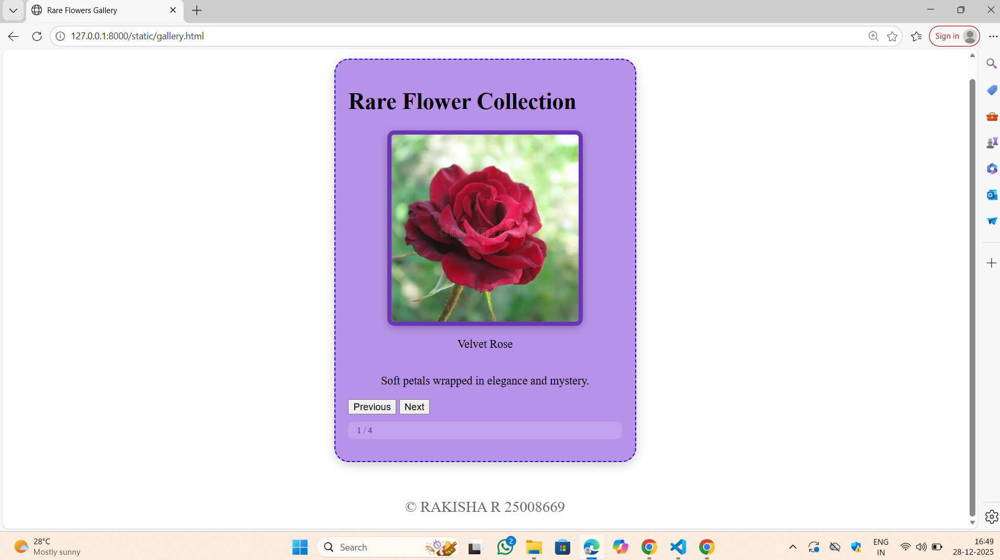
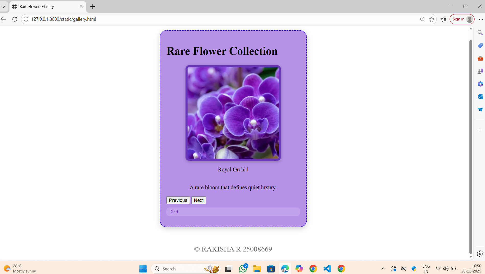
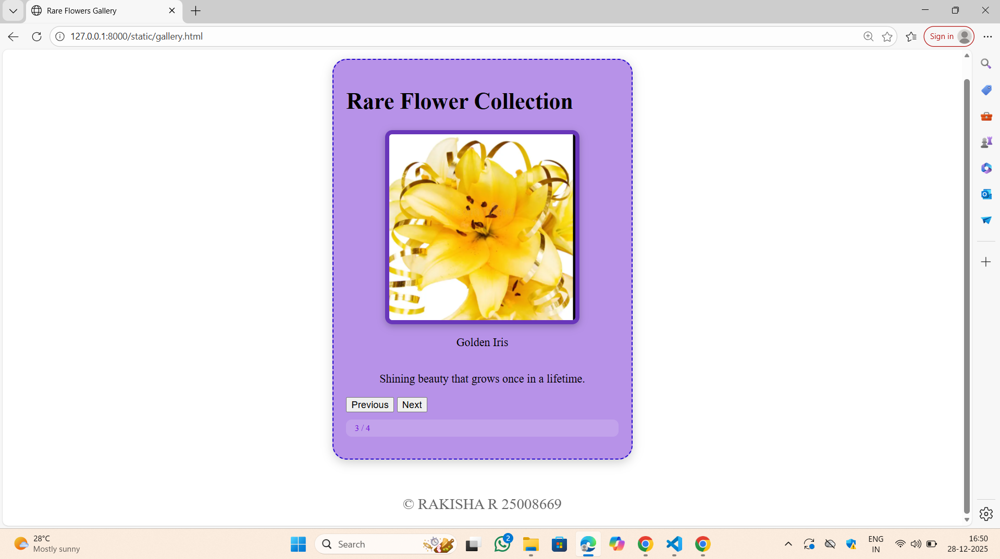
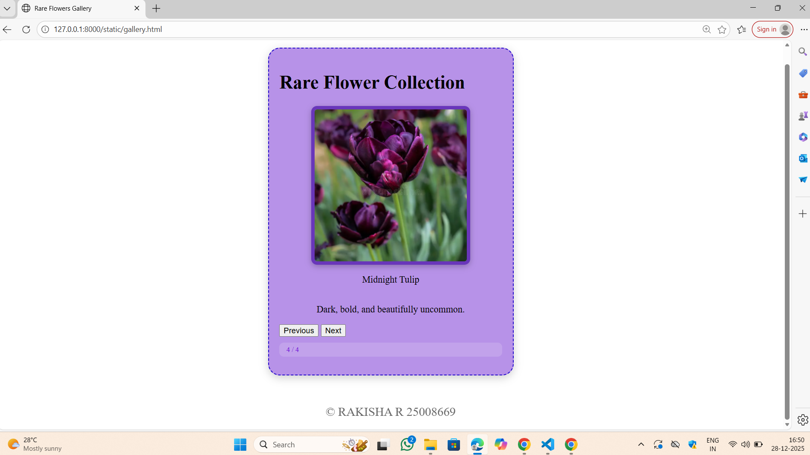

# Ex.07 Design of Interactive Image Gallery
## Date:28-12-2025

## AIM:
To design a web application for an inteactive image gallery for a minimum five images with next and previous buttons.

## DESIGN STEPS:

### Step 1:
Clone the github repository and create Django admin interface.

### Step 2:
Change settings.py file to allow request from all hosts.

### Step 3:
Use CSS for positioning and styling.

### Step 4:
Write JavaScript program for implementing interactivity.

### Step 5:
Validate the HTML and CSS code.

### Step 6:
Publish the website in the given URL.

## PROGRAM:
```
gallery.html

<html>
<head>
  <meta charset="UTF-8">
  <title>Rare Flowers Gallery</title>
  <link rel="stylesheet" href="gallery.css">
</head>
<body>

  <div class="box">
    <h1 class="heading">Rare Flower Collection</h1>
    <div class="image-area">
      

      <p class="title" id="title-text">Velvet Rose</p>
      <p class="info" id="info-text">Soft petals wrapped in elegance and mystery.</p>
    </div>

    <div class="buttons">
      <button onclick="prev()">Previous</button>
      <button onclick="next()">Next</button>
    </div>

    <p class="count" id="count-badge">1 / 5</p>

  </div>

  <footer class="footer">
    &copy; RAKISHA R 25008669
  </footer>
  
  <script src="gallery.js"></script>

</body>
</html>
gallery.css

.box {
  width: 70%;
  max-width: 380px;
  background: #b792e8;
  padding: 18px;
  border-radius: 20px;
  border: 2px dashed #2208cc;
  box-shadow: 0 4px 14px rgba(0,0,0,0.18);
  margin: 40px auto;
}

.image-area {
  display: flex;
  flex-direction: column;
  align-items: center;
  justify-content: center;
  width: 100%;
}

.image-area img {
  width: 260px;
  height: 260px;
  object-fit: cover;
  border-radius: 10px;
  border: 6px solid #6936ba;
  box-shadow: 0 3px 10px rgba(0,0,0,0.25);
  transform: none;
}

.count {
  font-size: 12px;
  margin-top: 10px;
  padding: 5px 12px;
  border-radius: 8px;
  background: rgba(255,255,255,0.15);
  color: #7116d9;
  font-weight: 500;
}

.footer {
  width: 100%;
  text-align: center;
  font-size: 21px;
  opacity: 0.6;
  margin-top: 30px;
  padding: 10px 0;
  border-top: 1px solid rgba(255,255,255,0.2);
}

gallery.js

const flowers = [
  {
    image: "rose.png",
    title: "Velvet Rose",
    info: "Soft petals wrapped in elegance and mystery."
  },
  {
    image: "orchid.png",
    title: "Royal Orchid",
    info: "A rare bloom that defines quiet luxury."
  },
  {
    image: "iris.png",
    title: "Golden Iris",
    info: "Shining beauty that grows once in a lifetime."
  },
  {
    image: "tulip.png",
    title: "Midnight Tulip",
    info: "Dark, bold, and beautifully uncommon."
  }
];

let index = 0;

const photo = document.getElementById("photo");
const titleText = document.getElementById("title-text");
const infoText = document.getElementById("info-text");
const countBadge = document.getElementById("count-badge");

function displayFlower() {
  photo.src = flowers[index].image;
  titleText.textContent = flowers[index].title;
  infoText.textContent = flowers[index].info;
  countBadge.textContent = (index + 1) + " / " + flowers.length;
}

function next() {
  index = (index + 1) % flowers.length;
  displayFlower();
}

function prev() {
  index = (index - 1 + flowers.length) % flowers.length;
  displayFlower();
}

displayFlower();

```

## OUTPUT:






## RESULT:
The program for designing an interactive image gallery using HTML, CSS and JavaScript is executed successfully.
